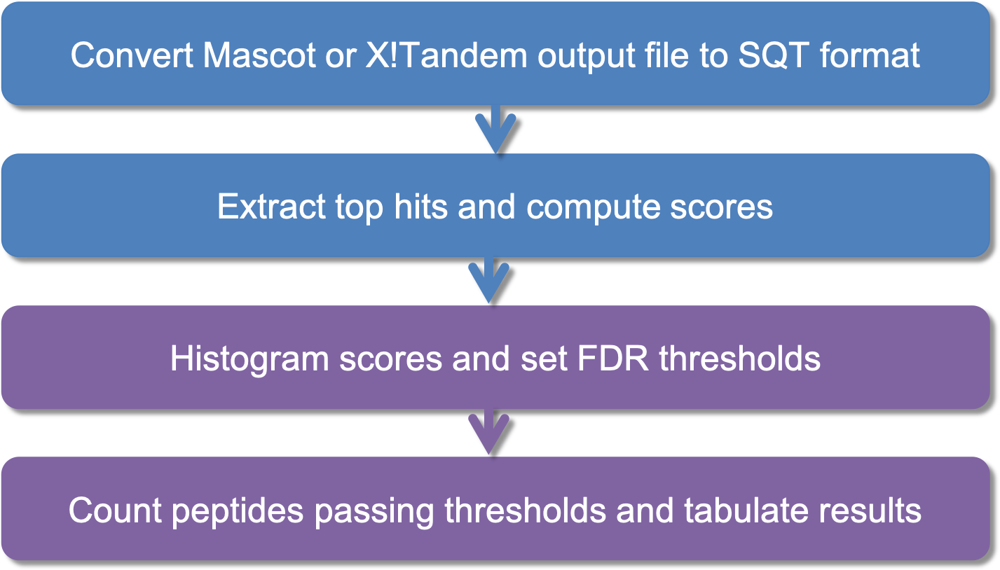
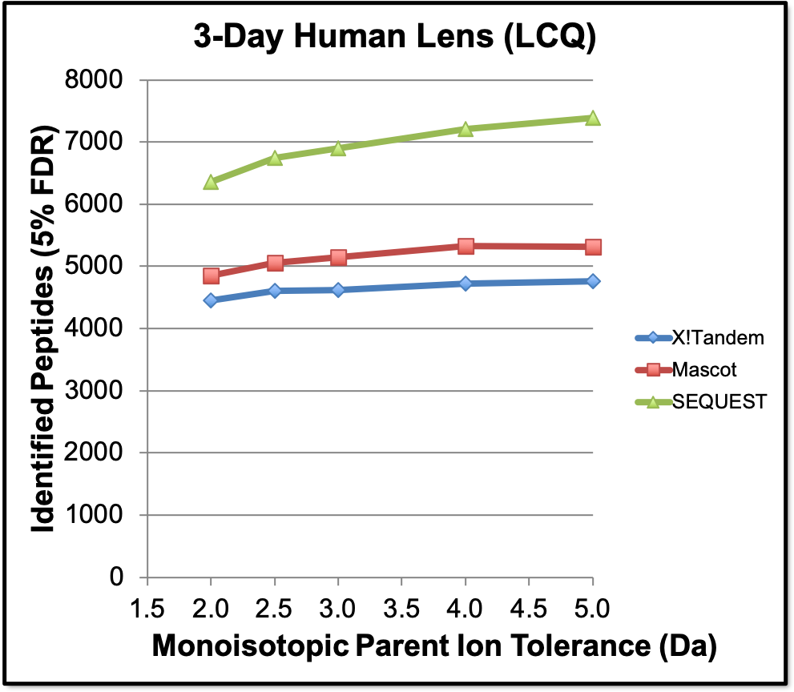
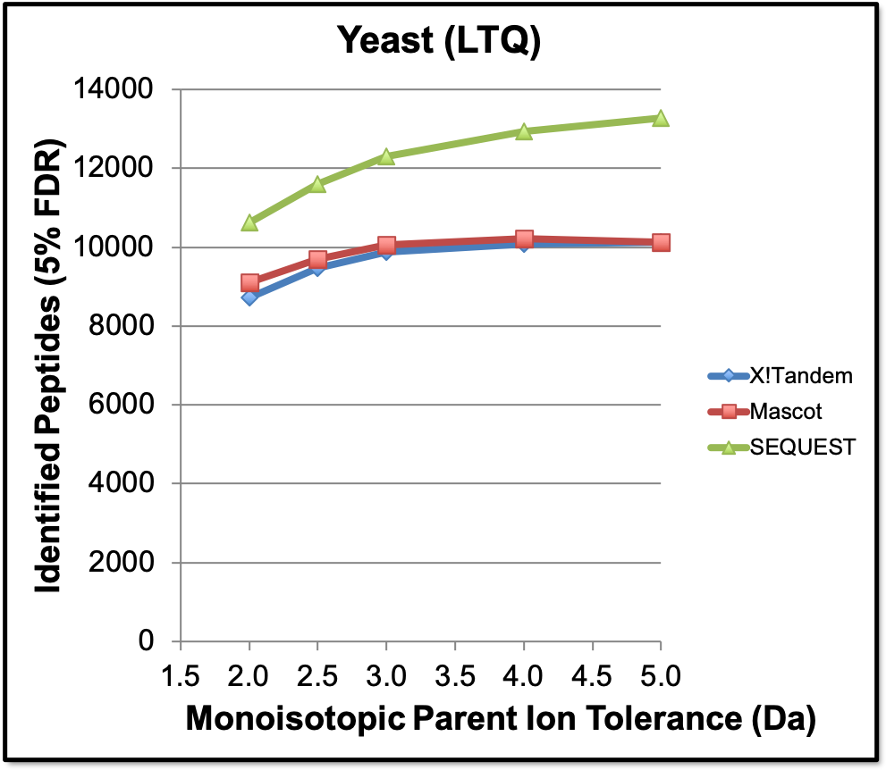
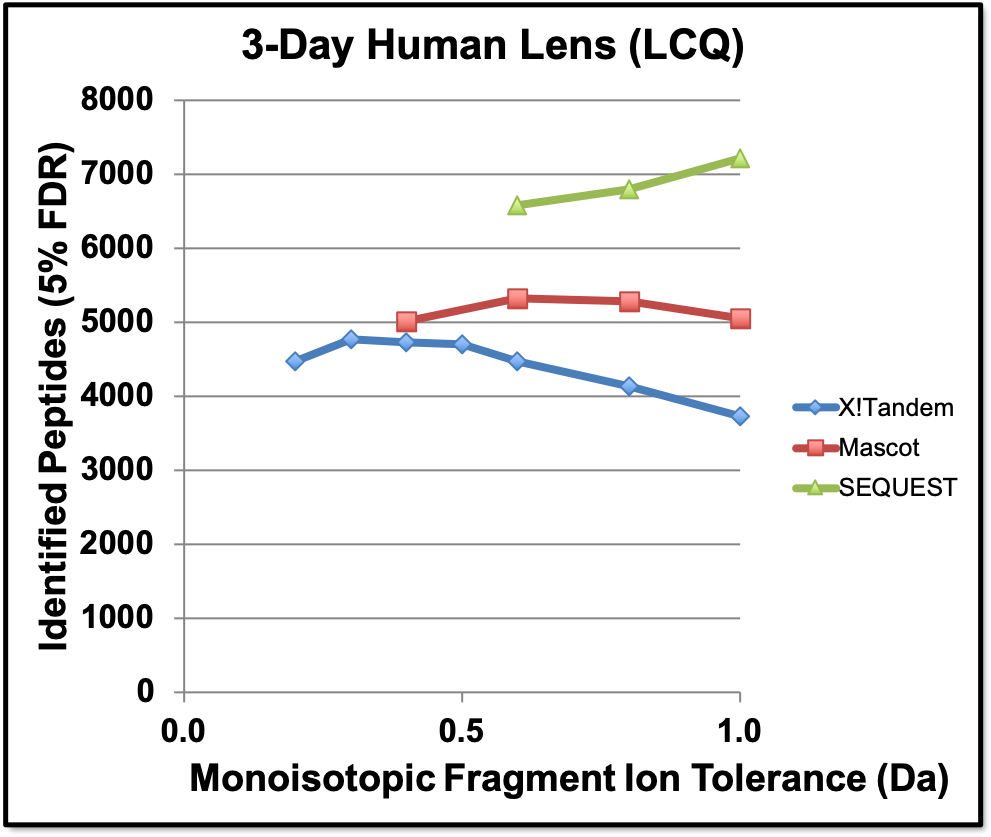
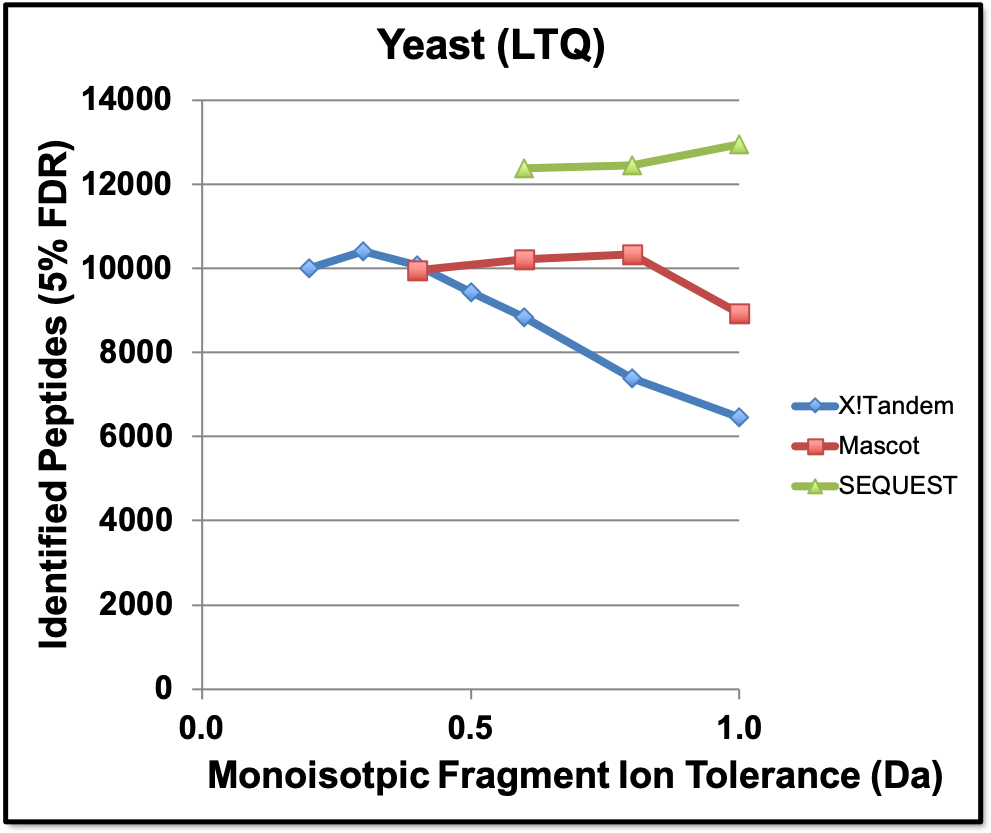
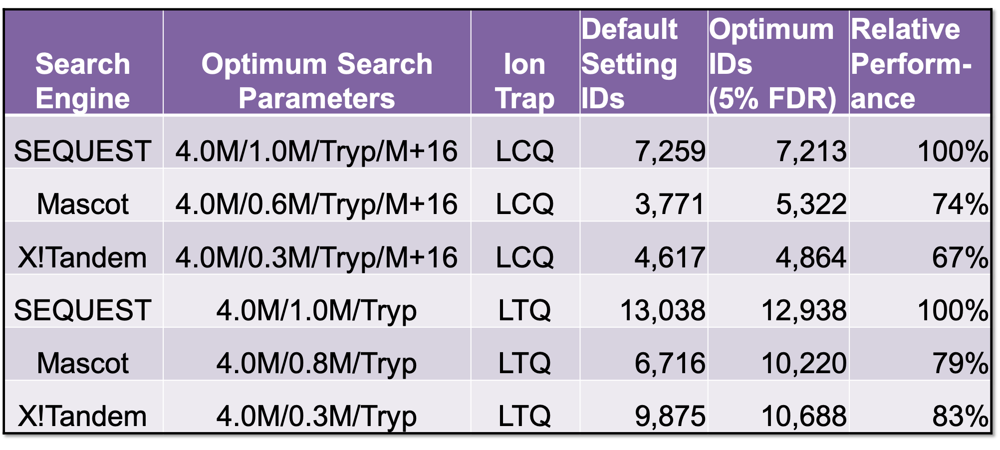

### Repository: github.com/pwilmart/ASMS-2013_search-engine-comparison

#### Poster presented at the 2013 [American Society of Mass Spectroscopy](https://www.asms.org) annual meeting in Minneapolis, MN, June 9-13, 2013.

---

# An unbiased comparison of peptide identification performance between SEQUEST, Mascot, and X!Tandem

## Phillip A. Wilmarth, William J. Rathje, and Larry L. David

### Department of Biochemistry and Molecular Biology, Oregon Health & Science University, Portland OR

---

### Background:  
- Unbiased comparisons between search programs to determine which performs best are challenging.
- Some search parameters should be matched and others can invalidate comparisons if they are matched.  
- Consistent data processing is essential.

> An interesting read is [Toward objective evaluation of proteomic algorithms](https://www.nature.com/articles/nmeth.1983) by John Yates III, et al., Nature Methods, 2012, 9:455.

### Overview:  
- Search parameter space systematically explored for Mascot ([Matrix Science](http://www.matrixscience.com/search_form_select.html), Ver. 2.2.1), SEQUEST (Thermo Scientific, Ver. 28 Rev. 12), and X!Tandem (www.theGPM.org, Ver. win-11-12-01-1).
- Biological datasets from LCQ (3-day old human lens) and LTQ (yeast lysate [Käll, et al. (2007) Nat Methods 4:923-5](https://www.nature.com/articles/nmeth1113)) ion traps were used.
- Target/decoy databases were used to set common FDR thresholds in each of the 240+ searches.
Mascot and X!Tandem results files converted to formats compatible with a flexible processing pipeline [Wilmarth, et al. (2009) Ocul Biol Dis Infor 2:223-34](https://link.springer.com/article/10.1007/s12177-009-9042-6).
- Consistent processing eliminated biases.
- The number of matches given identical sets of spectra and identical sets of theoretical peptides at a given peptide error rate could be determined for SEQUEST, Mascot, andX!Tandem.

---

**Data processing workflow.**  Conversion to common file formats at beginning of pipeline ensured consistent data processing for all comparisons.

---

**Parent ion mass tolerance and other search space parameters should be matched.**  Some search engine parameters are operational. Other parameters affect scoring functions (see below). Remaining parameters determine the number of theoretical peptides (search space) scored during searches. Examples are protein database, enzymatic cleavage, fixed and variable modifications, parent ion mass type and parent ion mass tolerance. These parameters should be matched between search engines for unbiased comparisons. Shown above are several parent ion mass tolerances (fragment ion tolerances were search engine default values). Parent ion mass tolerance optimum was independent of search program.

---

**Scoring functions are sensitive to fragment ion tolerances.**  Mascot (0.6 Da), X!Tandem (0.4 Da), and SEQUEST (1.0 Da) default values are close to optimum. Monoisotopic masses should always be used for fragment ions. Dramatic decreases in number of IDs were observed for average mass tolerances below 0.6 Da. For a 4.0M Da parent ion tolerance (shown above), optimum parameters are different for each search engine and should not be matched when performing comparisons.

---

**SEQUEST outperformed Mascot and X!Tandem.**  Parent ion monoisotopic mass tolerance of 4.0 Da was used. X!Tandem uses monoisotopic parent ion masses. Mascot requires the same  parent ion and fragment ion mass types. Optimum fragment ion tolerances were used for each search engine. X!Tandem dynamic ranges of 250 (LCQ) or 500 (LTQ) and 75 peaks improved IDs over default settings by 2-3%. Automatic modifications and refinement searches were not used for X!Tandem. The last column indicates relative peptide identification performance where SEQUEST clearly outperformed the other search engines. Transformed scores were used: PeptideProphet-like function for SEQUEST, (Ion Score)-(Identity Score) for Mascot, and –Log(expectation score) for X!Tandem. Using XCorr, Ion Score, or Hypergeometric score reduced SEQUEST’s gain to 15% for LCQ and 10% for LTQ. Default settings for Mascot (1.2M Da, 0.6M Da) reduced IDs by 30%. X!Tandem defaults (-0.5/+3.0M, 0.4M) were 6% below optimum. A 2.5 Da average parent ion tolerance was the SEQUEST default.

> SEQUEST supports different mass types for parent and fragment ion mass tolerances. A 4.0 Da monoisotopic parent ion tolerance is similar to a 2.5 Da average parent ion mass tolerance. The very wide parent ion mass tolerances that were optimal on these low resolution instruments would not be appropriate for newer high mass accuracy instruments.

---

### Summary:  
- SEQUEST outperformed Mascot and X!Tandem.
- Fragment ion tolerances should be optimized, not matched, for each search engine.
- Parameters controlling search space size should be matched for unbiased comparisons.
- Fragment ion mass type should always be monoisotopic.
- Default parameter settings were not optimum.

---

Supported by NIH grants EY007755 and EY010572.

Author contact: wilmarth@ohsu.edu    
